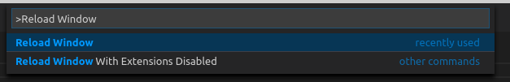

# Visual Studio Code Linting Rules Installation

> Note: lookbehind assertion in regular expressions breaks error highlighting, rules `case-sensitive`, `backtick-keywords` do not work in `vscode`. Consider [manual](./README.md#manual-checks) checks.

Assuming you have [markdownlint](https://marketplace.visualstudio.com/items?itemName=DavidAnson.vscode-markdownlint) extension installed.

1. Clone `axibase/docs-util` repository:

    ```bash
    git clone https://github.com/axibase/docs-util.git
    ```

2. Press <kbd>F1</kbd>, type `settings` and select **Preferences: Open Workspace Settings** to install for current workspace, or **Preferences: Open User Settings** to install globally.

    

3. Add `markdownlint.customRules` property to configuration JSON file on the right panel. List `.js` files from `linting-rules` directory.

    ```json
        "markdownlint.customRules": [
            "<path-to-docs-util>/linting-rules/relative-image-urls.js",
            ...
        ]
    ```

    
    
Current rules:

```javascript
"markdownlint.customRules": [
    "</path/to>/docs-util/linting-rules/relative-image-urls.js",
    // "</path/to>/docs-util/linting-rules/backtick-keywords.js", doesn't work in vscode
    "</path/to>a/docs-util/linting-rules/blacklisted.js",
    "</path/to>/docs-util/linting-rules/backtick-http.js",
    "</path/to>/docs-util/linting-rules/whitelist-mail-url-ip.js",
    // "</path/to>/docs-util/linting-rules/blacklisted-for-use-cases.js",
    // "</path/to>/docs-util/linting-rules/case-sensitive.js", doesn't work in vscode
    "</path/to>/docs-util/linting-rules/no-space-in-fenced-code.js",
    "</path/to>/docs-util/linting-rules/ls-info-for-charts-code.js"
]
```

4. Save configuration file changes.
5. If you are installing rules locally, press **Allow** in the popup. In the other case restart VSCode.
    

6. If rules are not applied try to reload window: press <kbd>F1</kbd>, enter **Reload Window**.


