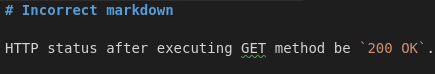
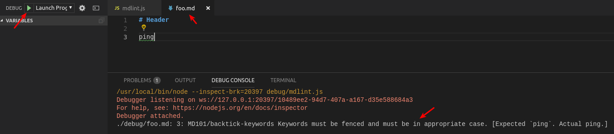
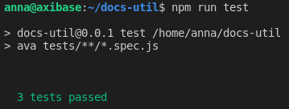

# How To Add Custom markdownlint Rule

## Create Rule File

Create JavaScript file in `linting-rules` directory, e.g. `my-rule.js`. It must be a CommonJS module, which exports object with structure described below:

```typescript
module.exports = {
    /**
     * Name of rule, used in config files. Add MD1XX code, where XX should be 
     * incremental, and the name of current file
     */
    names: string[];
    /**
     * Rule ID and human-readable description
     */
    description: string;
    /**
     * Add some groups which this rule can belong to
     */
    tags: string[]
    /**
     * Test function itself
     */
    "function": (params, onError) => void;
}
```

See the [official guide](https://github.com/DavidAnson/markdownlint/blob/master/doc/CustomRules.md) for details and examples.
Since we use Node 8 or Chromium you can use most of ES6 features, except esm-modules.

## Implement Test Function

Test function takes 2 arguments: `params` object and `onError` callback.
The most important thing in the function input is `params.tokes` field, which is the list of document tokens, parsed by `markdown-it`. Visit the [API reference](https://markdown-it.github.io/markdown-it/#Token) for details.
One useful tool is the [`markdown-it` playground](https://markdown-it.github.io/), which can help you to discover how the token tree looks for your test case. Type an example and go to debug tab.

The `onError` callback takes an object, describing what goes bad and where. The only required field is `lineNumber`, but try to provide as much info, as possible. Take a look at [InlineTokenChildren](common/InlineTokenChildren.js) module, it helps to [iterate](linting-rules/backtick-keywords.js#L73) over `token.children` array. Also it useful to provide [range](linting-rules/backtick-keywords.js#L90) array for proper underline in VSCode:



Refer to Axibase rule [rules](README.md#axibase-rules).

## Debug Rule

To debug the rule configure [mdlint.js](debug/mdlint.js), replace `<rule-filename>` with appropriate rule, for example `my-rule.js`:


Add some cases to `foo.md` and start debug:



## Run Tests

Before commit changes ensure tests are passed:

```javascript
npm install
npm run test
```


