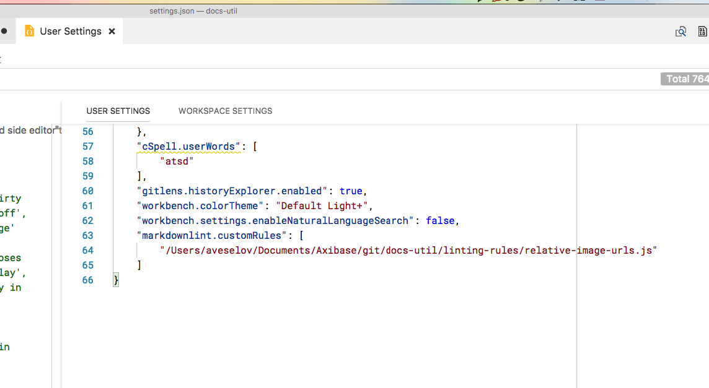
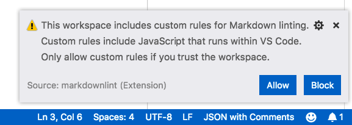

# Visual Studio Code Linting Rules Installation

Assuming you have [markdownlint](https://marketplace.visualstudio.com/items?itemName=DavidAnson.vscode-markdownlint) extension installed.

1. Clone `axibase/docs-util` repository

2. Press <kbd>F1</kbd>, type `settings` and select **Preferences: Open Workspace Settings** to install for current workspace, or **Preferences: Open User Settings** to install globally.


3. Add `markdownlint.customRules` property to configuration JSON file on the right panel. List all `.js` files in `linting-rules` directory.

```json
    "markdownlint.customRules": [
        "<path-to-docs-util>/linting-rules/relative-image-urls.js",
        ...
    ]
```



4. Save configuration file changes.

5. If you are installing rules locally, press **Allow** in the popup. In the other case restart VSCode.


